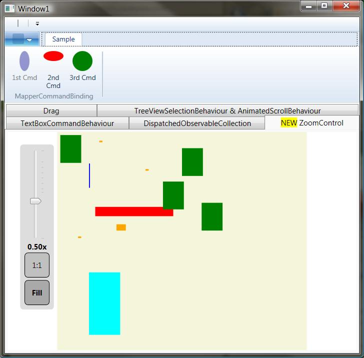

Some extensions for the WPF framework.
Controls, attached behaviours, helper classes, etc.

For example: Zoom Control, DragBehavior, Thread-safe observable collection, etc...

**Sample application included!**

* Attached Behaviours
	* **DragBehavior**: you can add this Behaviour to any FrameworkElement or FrameworkContentElement based control. For the usage see the [DragBehaviour Sample](DragBehaviour-Sample)
	* **Animated Scroll Behaviour**: you can add animated scrolling behaviour to any ScrollViewer
	* **TextBox Command Behaviour**: you can add Command support to any TextBox. Command execution can be triggered in 5 different ways (Disabled, Enter, Focus, Unfocues, TextChange)
	* **DispatchedObservableCollection**: access the observable collection from a background thread while its bound to the UI in WPF
* Custom Controls
	* **Zoom Control**: panning, zooming (with scroll and with zoom box), automatic fill, animated, support templates
		* {"SHIFT + mouse drag"}: pan
		* {"CTRL + mouse scroll"}: zoom
		* {"ALT + mouse drag"}: zoombox
* Converters
	* **BoolToVisibilityConverter**: a simple litte IValueConverter which converts bool? to Visibility
* Helper classes
	* **ExtLogicalTreeHelper**: helps to find an ancestor of any element in the LogicalTree (can navigate through Parent and TemplatedParent property).

* Commands, ViewModel
	* **CommandSink**, **CommandSinkBinding** (idea, implementation: Josh Smith [http://www.codeproject.com/KB/WPF/VMCommanding.aspx](http://www.codeproject.com/KB/WPF/VMCommanding.aspx))
	* **MapperCommandBinding**
		* one of my ideas
		* really handy when you want to use Microsoft's Ribbon Controls and your MVVM architecture with the CommandSinks and CommandSinkBindings

+**Feature requests are welcome!**+